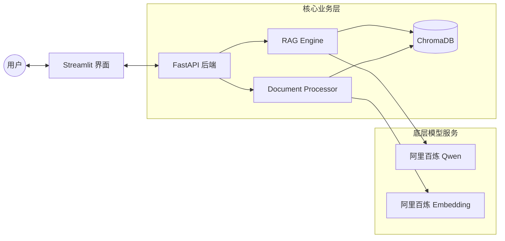

作为你的 RAG 开发经理，我为你梳理了 MVP 阶段的完整架构、核心代码实现以及一份正式的产品使用手册。

---

### 一、 系统架构图
该架构实现了**解耦设计**：前端负责交互，后端负责业务逻辑，核心层负责模型与数据，工具层负责文档解析。



---

### 二、 核心代码清单整理

#### 1. 环境配置 `.env`
```ini
DASHSCOPE_API_KEY=sk-你的真实apikey
LLM_MODEL=qwen-plus
EMBEDDING_MODEL=text-embedding-v2
CHROMA_PERSIST_DIR=./data/chroma_db
COLLECTION_NAME=rag_mvp_collection
CHUNK_SIZE=800
CHUNK_OVERLAP=150
```

#### 2. 配置管理 `core/config.py`
```python
from pydantic_settings import BaseSettings, SettingsConfigDict
from pydantic import Field

class Settings(BaseSettings):
    dashscope_api_key: str = Field(..., validation_alias="DASHSCOPE_API_KEY")
    llm_model: str = "qwen-plus"
    embedding_model: str = "text-embedding-v2"
    chroma_persist_dir: str = "./data/chroma_db"
    collection_name: str = "rag_mvp_collection"
    chunk_size: int = 800
    chunk_overlap: int = 150
    top_k: int = 4

    model_config = SettingsConfigDict(env_file=".env", extra="ignore")

settings = Settings()
```

#### 3. 模型工厂 `core/model_factory.py`
```python
from langchain_community.chat_models import ChatTongyi
from langchain_community.embeddings import DashScopeEmbeddings
from .config import settings

class ModelFactory:
    @staticmethod
    def get_llm():
        return ChatTongyi(
            model=settings.llm_model,
            dashscope_api_key=settings.dashscope_api_key,
            streaming=True
        )

    @staticmethod
    def get_embedding():
        return DashScopeEmbeddings(
            model=settings.embedding_model,
            dashscope_api_key=settings.dashscope_api_key
        )
```

#### 4. 向量库管理 `core/vector_manager.py`
```python
from langchain_community.vectorstores import Chroma
from .model_factory import ModelFactory
from .config import settings

class VectorManager:
    def __init__(self):
        self.embeddings = ModelFactory.get_embedding()
        self.vector_store = Chroma(
            collection_name=settings.collection_name,
            embedding_function=self.embeddings,
            persist_directory=settings.chroma_persist_dir
        )

    def add_documents(self, documents):
        self.vector_store.add_documents(documents)

    def get_retriever(self):
        return self.vector_store.as_retriever(search_kwargs={"k": settings.top_k})
```

#### 5. RAG 引擎 `core/rag_engine.py`
```python
from langchain_core.prompts import ChatPromptTemplate
from langchain_core.output_parsers import StrOutputParser
from langchain_core.runnables import RunnablePassthrough
from .model_factory import ModelFactory
from .vector_manager import VectorManager

class RAGEngine:
    def __init__(self):
        self.llm = ModelFactory.get_llm()
        self.vector_manager = VectorManager()

    def get_chain(self):
        prompt = ChatPromptTemplate.from_template("""
        你是一个专业的企业知识助手。根据以下上下文回答问题。如果你不知道，请直说不知道。
        上下文: {context}
        问题: {question}
        回答:""")
        
        retriever = self.vector_manager.get_retriever()
        
        chain = (
            {"context": retriever | (lambda docs: "\n\n".join(d.page_content for d in docs)), 
             "question": RunnablePassthrough()}
            | prompt
            | self.llm
            | StrOutputParser()
        )
        return chain
```

#### 6. 文档处理工具 `utils/document_processor.py`
```python
from langchain_community.document_loaders import PyPDFLoader, TextLoader, UnstructuredWordDocumentLoader
from langchain_text_splitters import RecursiveCharacterTextSplitter
from core.config import settings
import os

class DocumentProcessor:
    def __init__(self):
        self.splitter = RecursiveCharacterTextSplitter(
            chunk_size=settings.chunk_size, 
            chunk_overlap=settings.chunk_overlap
        )

    def load_file(self, file_path):
        ext = os.path.splitext(file_path)[-1].lower()
        if ext == ".pdf": loader = PyPDFLoader(file_path)
        elif ext == ".docx": loader = UnstructuredWordDocumentLoader(file_path)
        else: loader = TextLoader(file_path, encoding="utf-8")
        return loader.load()
```

#### 7. 后端入口 `main.py`
```python
from fastapi import FastAPI, UploadFile, File
from core.rag_engine import RAGEngine
from utils.document_processor import DocumentProcessor
from core.vector_manager import VectorManager
import shutil, os

app = FastAPI()
engine = RAGEngine()
processor = DocumentProcessor()
vector_manager = VectorManager()

@app.post("/upload")
async def upload(file: UploadFile = File(...)):
    path = f"temp_{file.filename}"
    with open(path, "wb") as f: shutil.copyfileobj(file.file, f)
    docs = processor.load_file(path)
    splits = processor.splitter.split_documents(docs)
    vector_manager.add_documents(splits)
    os.remove(path)
    return {"status": "success", "chunks": len(splits)}

@app.post("/chat")
async def chat(data: dict):
    chain = engine.get_chain()
    answer = await chain.ainvoke(data["query"])
    return {"answer": answer}
```

#### 8. 前端界面 `frontend.py`
```python
import streamlit as st
import requests

st.title("企业 RAG 助手 MVP")
BASE_URL = "http://127.0.0.1:8000"

with st.sidebar:
    uploaded_file = st.file_uploader("上传知识文档")
    if st.button("上传入库"):
        files = {"file": uploaded_file.getvalue()}
        res = requests.post(f"{BASE_URL}/upload", files={"file": (uploaded_file.name, uploaded_file.getvalue())})
        st.success("入库成功")

if prompt := st.chat_input():
    st.chat_message("user").write(prompt)
    res = requests.post(f"{BASE_URL}/chat", json={"query": prompt})
    st.chat_message("assistant").write(res.json()["answer"])
```

---

### 三、 产品介绍与使用手册

以下是为你准备的 Markdown 格式文档：

# 企业级 RAG 助手 (MVP 版本) 使用手册

## 1. 产品概述
本产品是一款基于 **检索增强生成 (RAG)** 技术的智能助手。它能够通过读取企业私有文档（PDF, Word, TXT），构建本地知识库，并结合阿里百炼（通义千问）大模型提供精准的问答服务。

### 核心优势
*   **隐私安全**：文档存储在本地向量库 ChromaDB 中。
*   **回答准确**：仅根据提供的文档回答，有效抑制大模型幻觉。
*   **灵活扩展**：采用模块化设计，支持快速更换模型和数据库。

## 2. 技术栈
*   **语言**：Python 3.11
*   **后端**：FastAPI + LangChain 1.0
*   **前端**：Streamlit
*   **模型**：阿里百炼 (Qwen-Plus + Text-Embedding-v2)
*   **向量库**：ChromaDB

## 3. 环境准备
1.  **获取 API Key**：登录阿里百炼平台获取 `DASHSCOPE_API_KEY`。
2.  **安装依赖**：
    ```bash
    pip install langchain langchain-community langchain-core dashscope chromadb pydantic-settings fastapi uvicorn streamlit python-multipart unstructured
    ```
3.  **配置文件**：在根目录创建 `.env` 文件并填入你的 API Key。

## 4. 快速启动
本系统采用前后端分离架构，需启动两个服务：

### 第一步：启动后端服务
```bash
python main.py
```
*   默认地址：`http://127.0.0.1:8000`
*   API 文档预览：`http://127.0.0.1:8000/docs`

### 第二步：启动前端界面
```bash
streamlit run frontend.py
```
*   默认地址：`http://localhost:8501`

## 5. 功能操作指南
1.  **知识导入**：
    *   在左侧边栏点击“上传知识文档”。
    *   点击“上传入库”，系统将自动完成文件解析、切片及向量化。
2.  **智能问答**：
    *   在对话框输入关于文档内容的问题。
    *   系统将检索相关片段并给出专业回复。

## 6. 注意事项
*   **文档质量**：建议上传文字清晰的文档，图片型 PDF 需额外安装 OCR 插件。
*   **网络连接**：由于使用了阿里百炼在线 API，请确保服务器网络畅通。
*   **数据持久化**：向量数据保存在 `./data/chroma_db` 目录下，删除该目录可重置知识库。

---

**开发经理寄语**：该 MVP 版本已具备 RAG 的核心链路。在接下来的版本中，我们将引入 **Rerank（重排序）** 和 **引用溯源（Citations）** 功能，以进一步提升回答的专业度和可信度。